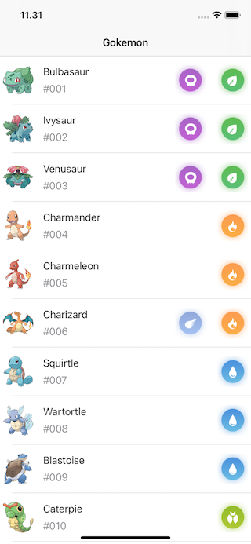

# Gokemon
## Pokemon iOS App

### Screenshots

Done: 
- [x] Use clean architecture with clear code separation
- [x] Use codable for model and JSON parsing
- [x] Use autolayout for view
- [x] Save the API result to local cache(Realm, CoreData, sqlite, etc) , and load it from cache first, while making request to API
- [ ] Jupiter
- [ ] Saturn

TODO: 
- [ ] Handling error when there is no internet connection, or got error from API
- [ ] Having unit test 
- [ ] Research more about API. 
